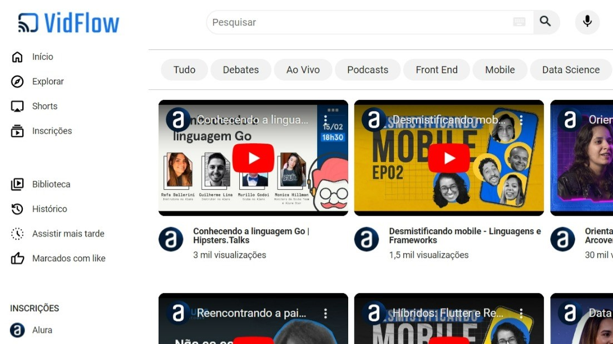

[](https://app.netlify.com/sites/vidflow/deploys)

# VidFlow

Um projeto de uma plataforma de vídeos fictícia criada no curso "JavaScript: consumindo e tratando dados de uma API" da [Alura](https://cursos.alura.com.br/).

Nesse curso foi usado o plugin json-server para emular uma API Rest para ser consumida via Fetch API.

No curso foram abordados temas como asyn/await, try/catch, assincronicidade dentre outros.

## Tecnologias utilizadas

- HTML
- CSS
- JavaScript

## Como acessar online

O deploy do projeto foi feito pelo [Netilify](https://www.netlify.com/) e está disponível em https://vidlfow.netlify.app/

## Como rodar localmente

Este projeto usa JavaScript puro. No entanto, importa dados de um arquivo JSON, então é preciso usar o json-server para rodá-lo localmente.

No caso, primeiro você precisará baixar o projeto com o seguinte comando:

```bash
git clone https://github.com/RenanSantos7/vidflow.git
```

Agora, a pasta em que o projeto foi salvo no Visual Studio Code. Então, abra o terminal integrado e rode o seguinte comando para instalar o json-server:

```
npm install -g json-server
```

Após, rode o seguinte comando para que o json-server leia o JSON com os dados:

```
json-server --watch backend/videos.json
```

Agora basta abrir o arquivo `index.html` dando duplo clique nele no seu gestor de arquivos ou com o Live Server no vscode.